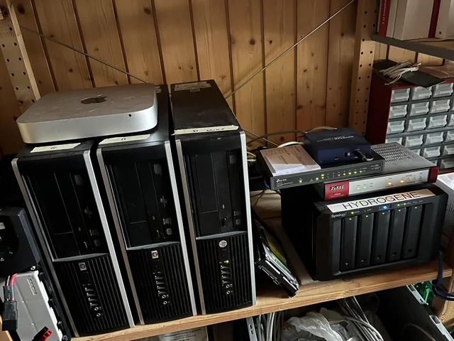

# HomeLab: How DevOps manage information and maintain high availability of the home infrastructure

Get to know how DevOps compute, stores, preserves, presents, and plays with information and data but also maintains high availability of the home infrastructure using corporation-grade software and hardware

## Introduction
A long time ago, when I was only a kid, I had rather a good pc (as for those times) with a tremendous 80 GB of hard disk, powerful Intel Core 2 Duo, and 2 GB of RAM. I was very happy with it. I was able to play games, watch movies, listen to music, and do my homework and everything I wanted and needed.

But only for some time. Because after a couple of months, I discovered the world of the Internet - P2P, Linux, and unfortunately my library of favorite music started to grow very quickly. I realized that I needed more space. And because that was the time when harddisks were not so cheap - I had to have started deleting the stuff.

Today, 18 years later, I have no longer this issue as I have built my own private HomeLab/NAS/Archive.org with rather small disk space - roughly 96 TB raw space - but somehow it fits my things.

## Types of HomeLabs

## History of my HomeLabs

## My current HomeLab

## Hardware at my HomeLab

## Motives

## Documentation at my HomeLab

## Networking at my HomeLab

## Host Operating System at my HomeLab

## VM & K8s software at my HomeLab

## Monitoring at my HomeLab

## Weather at my HomeLab

## Costs at my HomeLab

## It's never enough
