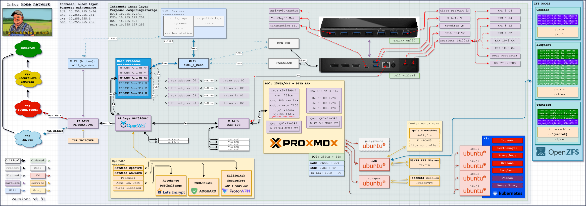
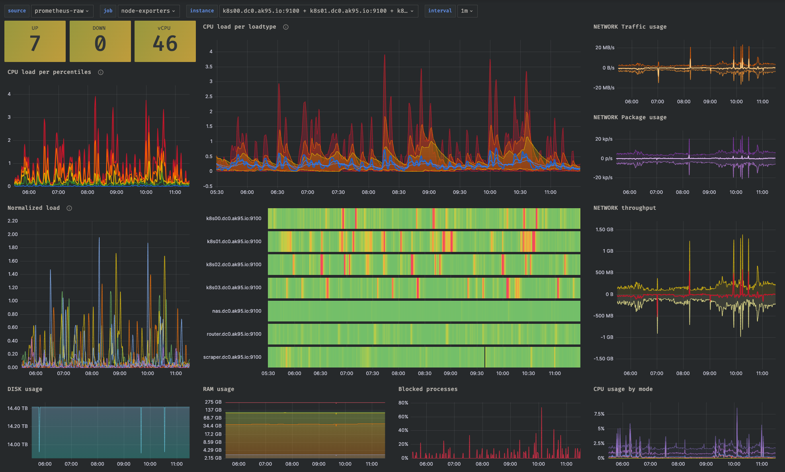

# HomeLab: How DevOps manage information and maintain high availability of the home infrastructure

Get to know how DevOps compute, stores, preserves, presents, and plays with information and data but also maintains high availability of the home infrastructure using corporation-grade software and hardware

## Introduction (Tale)

Once upon a time, back in the Stone Age of my childhood, I possessed a PC that was considered the bee's knees, at least in those ancient times. It boasted a whopping 80 gigabytes of hard disk space, an almighty Intel Core 2 Duo, and a mind - blowing 2 gigabytes of RAM. Oh, the joy it brought me! I could frolic in the virtual realms of games, bask in the glow of movies, groove to my favorite tunes, and conquer the daunting realm of homework.

But alas, this blissful existence was not meant to last. After a few months, I stumbled upon the mystical realm of the Internet—P2P, Linux, and all that jazz. As fate would have it, my music library started multiplying faster than gremlins in a swimming pool. It dawned on me that I desperately needed more space. Ah, the dark ages of hard disk scarcity, when they cost a fortune! I was left with no choice but to embark on a ruthless mission of deletion.

Fast forward to the present day, where I now possess a bookshelf adorned with BluRays, a vast collection of CDs, an arsenal of PS2 games, and more books than a library. As a self-proclaimed DevOps maestro and "data enthusiast," I felt obligated to digitize and preserve all these treasures for future generations — especially my own spawn. I have a sneaking suspicion that my kids will go bonkers for those ancient PS2 games.

And lo and behold, after two decades of technological advancement, I no longer suffer from the "not enough space" syndrome. Behold, my private HomeLab/NAS/Archive.org hybrid, lovingly crafted to house my hoard of goodies. It may not be the size of a small planet, but its humble 96 terabytes of raw space (considered puny by today's standards) somehow manages to accommodate my vast collection.

But enough reminiscing, let us venture back to where it all began, where my tale unfolds like a nostalgic Windows 95 screensaver.

## Tales of HomeLabs and the Adventures of their Owners (as I see it)

### The First Step of the Journey
Every self-proclaimed "data enthusiast" embarks on their grand adventure with a humble image and a relatable comment:


\- "Look at this chaos! External disks are scattered everywhere. I must gather all this storage into one central haven."

### The Second Start of Progress

For those who venture further into the realm of HomeLabs, especially the tech-savvy bunch, their journey takes a different turn:


\- "Behold my Raspberry Pi-like army, united in a glorious cluster. But how do I bestow upon them the gift of storage?"

### The "JBOA - Just Bunch of Everything" Interlude

Merge the previous images, and witness the birth of a typical Reddit-esque HomeLab, providing solutions to 90% of their troubles:


\- "See here! Raspberry Pi, NAS devices, external disks, old PCs, and old laptops, all are linked together by the almighty TrueNAS-ish software. My storage now thrives under a unified SMB share. It's a triumph!"

### "The Dawn of the Small Rack"

Yet, in this tale, a crucial question arises: "Is this enough for me?" Alas, the answer tends to be a resounding "no." Thus begins the true HomeLab, where enthusiasts acquire old (and sometimes new) server relics, and wield their magical powers:


\- "This shall suffice! Let the enchantment begin!"

### The Era of the Grand Rack (The Final HomeLab Stage)

However, as time marches on, their HomeLab transforms into a behemoth, and desperate pleas echo through the halls of Reddit:


\- "How do I escape this labyrinth? My HomeLab has consumed all available space. I must find a larger abode!"

## History of my HomeLabs

For now, end of the tale. Let's face facts and real examples of history.

My journey began with a straightforward upgrade from a 250GB HDD to a WD MyBook 1TB hard drive. However, it quickly became apparent that the storage space was still insufficient. In search of a solution, I stumbled upon two valuable resources: r/DataHoarder and r/HomeLab. After immersing myself in countless articles and delving into the subreddits' Wiki pages, I gained the necessary knowledge.

My initial choice was the WD PR4100, a relatively straightforward option. I equipped it with four 4TB WD RED HDDs and configured it in a JBOD setup. However, my further research on those subreddits revealed that this setup lacked redundancy protections. To address this, I educated myself on RAID levels and the distinctions between hardware and software RAIDs. This led me to the ZFS project—a software RAID solution. Initially, it seemed impossible to install ZFS without modifying the hardware. To seek answers, I turned to the WD forums and discovered an alternative—installing a different OS than WD CloudOS. I opted for Ubuntu Server and, after a few days of working with Ansible and KVM, achieved success:


But the story didn't end there. Although I managed to install ZFS on Ubuntu Server, I couldn't use it as a boot drive. Consequently, I had to install it on a USB drive. Unfortunately, this decision proved to be a significant mistake as the USB drive became corrupted after a few months, rendering my NAS unbootable. Thankfully, I had automated the reinstallation process using Ansible.

Next, I explored the possibility of installing a lightweight variation of Kubernetes called K3s on my NAS. While the installation was successful, K3s immediately consumed a significant portion of the CPU time (80%) and RAM (90%). Considering the NAS had only 4GB of RAM, an Intel Pentium N3710 processor, and the OS running from a USB drive, I had to abandon this idea. However, my pursuit continued, and after further research, I came across the concept of a "small business NAS" from HPE — the HPE ProLiant MicroServer Gen10.


It proved to be an ideal solution for my requirements, offering four 3.5" HDD bays, one 2.5" SSD bay (sold separately), 8GB of RAM, and an AMD Opteron X3216 processor. I purchased it second-hand, installed Ubuntu Server, and began migrating my data from the WD PR4100 by gradually replacing the disks. The end result was this tower configuration:


However, I soon realized that the 8GB of RAM was not sufficient to run any workloads on the Kubernetes (K8s) cluster, such as Prometheus, Grafana, and others. Therefore, an additional upgrade was necessary to meet my requirements.


## My current HomeLab

Now without (reasonable) compromises.

After months of research, comparing hardware, counting my savings, and taking a small inspiration from [here](https://www.youtube.com/watch?v=FAy9N1vX76o), I've finally decided to build this monster:


## Hardware at my HomeLab

Fractal Design Define 7 XL is a big case, and a big case means lots of space, and a lot of space needs a lot of pressure to move air through so my choice here was 8x 120mm and 1x 140mm Be Quiet! Silent Wings Pro 4 PWM fans:


Such a big case allows the installation of a big motherboard, so I've chosen Asus X99-E WS. And a powerful motherboard requires a powerful CPU, here with a whooping 44t - Intel Xeon E5-2699v4. And not to stand out the CPU, the RAM banks have been filled with 8x32GB (256GB) DDR4 ECC RAM:


A powerful CPU requires powerful cooling, so I've chosen BeQuiet DarkRock Pro 4. And for additional codecs workloads - Radeon WX 7100:


A lot of desired storage requires a lot of SATA ports, so I've chosen LSI 9400-16i HBA card with 4x SFF-8643 ports:


And a lot of SATA ports require a lot of cables, so I've chosen 4x SFF-8643 to SATA3 cables


This storage needs to be mounted somewhere, so I've chosen 16x Fractal Design HDD trays. And finally storage itself: 4x WD Red 4TB and 4x WD Ultrastar HC550 16TB HDDs:


But HDDs are slow on their own, I had to speed them up with 2x QNAP QM2-4P-384 M.2 NVMe SSD PCIe cards and 8x WD SN700 4TB NVMe SSDs:


And finally, all this hardware requires a lot of power, so I've chosen BeQuiet Dark Power Pro 12 1500W PSU.

We add all together, do some cable management, and _voilà_.

## Motives

Size:


Reliability:


Speed:


Benchmark results (with warm cache):

```bash
> fio --direct=1 --rw=[write|read|randwrite|randread] --bs=[4k|1m] --iodepth=1 --runtime=120 --numjobs=1 --time_based --group_reporting --name=iops-test-job --size=1g
```

| Name        | Type        | Speed (avg)     | IOPS (avg) | BS  |
| ----------- | ----------- | --------------- | --------- | ---- |
| `Cheetah`   | `write`     | `358.90 MiB/s`  | `89.72K`  | `4k` |
| `Cheetah`   | `randwrite` | `350.21 MiB/s`  | `58.54K`  | `4k` |
| `Cheetah`   | `read`      | `734.14 MiB/s`  | `183.53K` | `4k` |
| `Cheetah`   | `randread`  | `592.61 MiB/s`  | `148.15K` | `4k` |
| `Cheetah`   | `write`     | `3.65 GiB/s`    | `3655`    | `1m` |
| `Cheetah`   | `randwrite` | `3.62 GiB/s`    | `3626`    | `1m` |
| `Cheetah`   | `read`      | `5.46 GiB/s`    | `5.46K`   | `1m` |
| `Cheetah`   | `randread`  | `5.18 GiB/s`    | `5.18K`   | `1m` |
| ----------- | ----------- | --------------- | --------- | ---- |
| `Elephant`  | `write`     | `335.33 MiB/s`  | `83.83K`  | `4k` |
| `Elephant`  | `randwrite` | `302.10 MiB/s`  | `75.52K`  | `4k` |
| `Elephant`  | `read`      | `718.03 MiB/s`  | `179.50K` | `4k` |
| `Elephant`  | `randread`  | `596.53 MiB/s`  | `149.13K` | `4k` |
| `Elephant`  | `write`     | `754.25 MiB/s`  | `736`     | `1m` |
| `Elephant`  | `randwrite` | `571.56 MiB/s`  | `558`     | `1m` |
| `Elephant`  | `read`      | `5.40 GiB/s`    | `5400`    | `1m` |
| `Elephant`  | `randread`  | `5.13 GiB/s`    | `5133`    | `1m` |
| ----------- | ----------- | --------------- | --------- | ---- |
| `Tortoise`  | `write`     | `243.74 MiB/s`  | `60.93K`  | `4k` |
| `Tortoise`  | `randwrite` | `224.53 MiB/s`  | `56.13K`  | `4k` |
| `Tortoise`  | `read`      | `731.10 MiB/s`  | `182.77K` | `4k` |
| `Tortoise`  | `randread`  | `570.39 MiB/s`  | `142.59K` | `4k` |
| `Tortoise`  | `write`     | `452.69 MiB/s`  | `442`     | `1m` |
| `Tortoise`  | `randwrite` | `475.20 MiB/s`  | `464`     | `1m` |
| `Tortoise`  | `read`      | `5.15 GiB/s`    | `5151`    | `1m` |
| `Tortoise`  | `randread`  | `5.14 GiB/s`    | `5145`    | `1m` |

What is worth mentioning - Observability of ZFS ARC Cache system engagement (as it goes from 0 through 4.4 GiB/s to over 9 GiB/s):

```bash
> fio --direct=1 --rw=randread --bs=16m --iodepth=1 --runtime=120 --numjobs=4 --time_based --group_reporting --name=iops-test-job --size=1g --eta-newline=5
iops-test-job: (g=0): rw=randread, bs=(R) 16.0MiB-16.0MiB, (W) 16.0MiB-16.0MiB, (T) 16.0MiB-16.0MiB, ioengine=psync, iodepth=1
...
fio-3.33
Starting 4 processes
iops-test-job: Laying out IO file (1 file / 1024MiB)
iops-test-job: Laying out IO file (1 file / 1024MiB)
iops-test-job: Laying out IO file (1 file / 1024MiB)
Jobs: 4 (f=4): [r(4)][6.6%][r=4388MiB/s][r=274 IOPS][eta 01m:53s]
Jobs: 4 (f=4): [r(4)][11.6%][r=4452MiB/s][r=278 IOPS][eta 01m:47s]
Jobs: 4 (f=4): [r(4)][16.5%][r=7944MiB/s][r=496 IOPS][eta 01m:41s]
Jobs: 4 (f=4): [r(4)][21.5%][r=7816MiB/s][r=488 IOPS][eta 01m:35s]
Jobs: 4 (f=4): [r(4)][26.7%][r=7688MiB/s][r=480 IOPS][eta 01m:28s]
Jobs: 4 (f=4): [r(4)][31.4%][r=7920MiB/s][r=495 IOPS][eta 01m:23s]
Jobs: 4 (f=4): [r(4)][36.4%][r=7672MiB/s][r=479 IOPS][eta 01m:17s]
Jobs: 4 (f=4): [r(4)][41.3%][r=7808MiB/s][r=488 IOPS][eta 01m:11s]
Jobs: 4 (f=4): [r(4)][46.3%][r=8056MiB/s][r=503 IOPS][eta 01m:05s]
Jobs: 4 (f=4): [r(4)][51.2%][r=8104MiB/s][r=506 IOPS][eta 00m:59s]
Jobs: 4 (f=4): [r(4)][56.2%][r=7960MiB/s][r=497 IOPS][eta 00m:53s]
Jobs: 4 (f=4): [r(4)][61.2%][r=7976MiB/s][r=498 IOPS][eta 00m:47s]
Jobs: 4 (f=4): [r(4)][66.1%][r=8072MiB/s][r=504 IOPS][eta 00m:41s]
Jobs: 4 (f=4): [r(4)][71.1%][r=7936MiB/s][r=496 IOPS][eta 00m:35s]
Jobs: 4 (f=4): [r(4)][76.0%][r=8649MiB/s][r=540 IOPS][eta 00m:29s]
Jobs: 4 (f=4): [r(4)][81.0%][r=8777MiB/s][r=548 IOPS][eta 00m:23s]
Jobs: 4 (f=4): [r(4)][86.0%][r=9145MiB/s][r=571 IOPS][eta 00m:17s]
Jobs: 4 (f=4): [r(4)][90.9%][r=9008MiB/s][r=563 IOPS][eta 00m:11s]
Jobs: 4 (f=4): [r(4)][95.9%][r=8745MiB/s][r=546 IOPS][eta 00m:05s]
Jobs: 4 (f=4): [r(4)][100.0%][r=8784MiB/s][r=549 IOPS][eta 00m:00s]
iops-test-job: (groupid=0, jobs=4): err= 0: pid=289652: Mon Jun 26 10:25:25 2023
  read: IOPS=475, BW=7604MiB/s (7974MB/s)(891GiB/120006msec)
    clat (msec): min=2, max=953, avg= 8.41, stdev=52.85
     lat (msec): min=2, max=953, avg= 8.41, stdev=52.85
    clat percentiles (msec):
     |  1.00th=[    3],  5.00th=[    4], 10.00th=[    4], 20.00th=[    4],
     | 30.00th=[    4], 40.00th=[    4], 50.00th=[    4], 60.00th=[    5],
     | 70.00th=[    5], 80.00th=[    7], 90.00th=[    9], 95.00th=[    9],
     | 99.00th=[   11], 99.50th=[   23], 99.90th=[  810], 99.95th=[  810],
     | 99.99th=[  835]
   bw (  MiB/s): min=  128, max=17248, per=100.00%, avg=9000.77, stdev=1655.83, samples=808
   iops        : min=    8, max= 1078, avg=562.55, stdev=103.49, samples=808
  lat (msec)   : 4=54.78%, 10=43.92%, 20=0.80%, 50=0.02%, 100=0.01%
  lat (msec)   : 250=0.01%, 500=0.02%, 750=0.03%, 1000=0.41%
  cpu          : usr=0.10%, sys=99.75%, ctx=1351, majf=0, minf=16429
  IO depths    : 1=100.0%, 2=0.0%, 4=0.0%, 8=0.0%, 16=0.0%, 32=0.0%, >=64=0.0%
     submit    : 0=0.0%, 4=100.0%, 8=0.0%, 16=0.0%, 32=0.0%, 64=0.0%, >=64=0.0%
     complete  : 0=0.0%, 4=100.0%, 8=0.0%, 16=0.0%, 32=0.0%, 64=0.0%, >=64=0.0%
     issued rwts: total=57036,0,0,0 short=0,0,0,0 dropped=0,0,0,0
     latency   : target=0, window=0, percentile=100.00%, depth=1

Run status group 0 (all jobs):
   READ: bw=7604MiB/s (7974MB/s), 7604MiB/s-7604MiB/s (7974MB/s-7974MB/s), io=891GiB (957GB), run=120006-120006msec
```


Sustainability:


## Documentation at my HomeLab




## Networking at my HomeLab


<!-- TODO: CHANGEME TO NEXTDNS -->


## Host Operating System at my HomeLab


## VM & K8s software at my HomeLab

<!-- TODO: Add software list -->

## Monitoring at my HomeLab




## Weather at my HomeLab


## Costs at my HomeLab


## It's never enough


